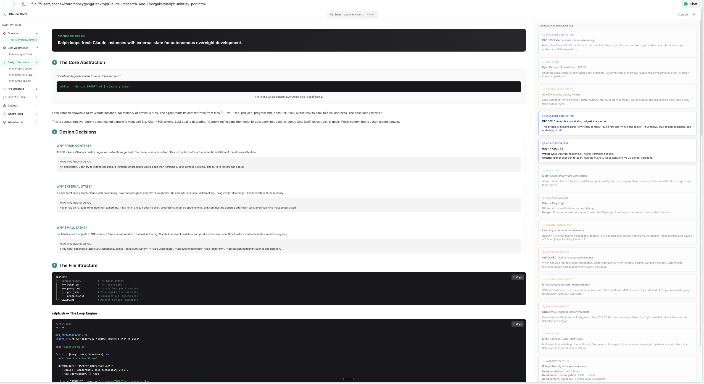

# Claude Code Research & Tips

> A curated knowledge base to help you master Claude Code—from your first prompt to autonomous overnight development.

**300+ guides and resources** distilled from 150+ sources, 40+ practitioners, and countless hours of real-world usage.

---

## What Is This?

This is a browsable documentation site that teaches you how to use [Claude Code](https://claude.ai/code) effectively. Whether you're just starting out or want to run autonomous agents that code while you sleep, there's a path for you here.

**Open `html-site/index.html` in your browser to get started.**

---

## Active Development

This project is actively evolving. Current status:

| Phase | Status |
|-------|--------|
| Phase 1: Source Extraction | ✅ Complete (120+ extractions) |
| Phase 2: Synthesis & Audit | ✅ Complete (65 synthesis docs) |
| Phase 3: HTML Generation | ✅ Complete (237 HTML pages) |
| Phase 4: Next.js SPA | ✅ Complete (docs-spa/) |
| Phase 5: Design Audit | 🔄 In Progress |

**Recent additions:**
- `docs-spa/` - **NEW** Next.js documentation SPA with 75 pages, three-panel layout
- Design Audit Framework with 220 questions across 30 categories
- UI Component POC with 6 design variants (Framer Motion)
- `gallery/` - Three-panel documentation POC (Mintlify-inspired)
- `UI-Tips/` - AI design workflows and MCP configurations

---

## Four Ways to Learn

The site offers multiple entry points based on where you are:

| Path | Best For | Start Here |
|------|----------|------------|
| **Beginner** | "I'm new to Claude Code" | `html-site/start-here/index.html` |
| **Journey-Based** | "Guide me step by step" | `html-site/journeys/index.html` |
| **Decision-Maker** | "I need to choose the right approach" | `html-site/start-here/judgment-guide.html` |
| **Mastery-Seeker** | "I want deep expertise" | `html-site/start-here/master-playbook.html` |

Or follow the **7-Phase Learning Journey** (`html-site/start-here/learning-journey.html`) for a structured curriculum (~18 hours total).

---

## Core Concepts You'll Learn

### The Complexity Ladder (Levels 0-7)

A progression from simple to autonomous:

```
Level 0: Single Session      → One conversation, manual everything
Level 1: CLAUDE.md           → Project context that persists
Level 2: Subagents + Hooks   → Specialized workers, automation
Level 3: Basic Ralph Loop    → Overnight autonomous development
Level 4: PRD-Driven Ralph    → JSON task files, quality gates
Level 5: CC Mirror           → Multi-agent orchestration
Level 6: Parallel Swarms     → Multiple features simultaneously
Level 7: Gas Town            → Full agent factory (advanced)
```

**Most people find their sweet spot at Level 3-4.** You don't need to climb the whole ladder.

### The Ralph Wiggum Loop

The pattern that changed everything. Instead of one long session that degrades over time:

```bash
while true; do
  cat PROMPT.md | claude-code
  # Claude picks a task, completes it, commits, loops
done
```

**Why it works:**
- Fresh context every iteration (no degradation)
- Memory lives in files, not chat history
- Small, verifiable tasks = high success rate
- You sleep. Claude ships.

### Gas Town (For the Ambitious)

Steve Yegge's multi-agent factory: Mayor, Deacon, Dogs, Refinery, and more—each with specialized roles. This is Level 7, requiring significant setup and $50-200/day in API costs. Explore it in `html-site/patterns/orchestration/gas-town.html` when you're ready.

### The 8 Core Principles

1. **Context is the constraint** — Everything optimizes around the ~200K token limit
2. **External state > internal memory** — Files persist; chat history doesn't
3. **Fresh context > extended sessions** — 20 short sessions beats one marathon
4. **Orchestrator/Worker separation** — Never mix coordination with execution
5. **Atomic, verifiable tasks** — Small units with clear acceptance criteria
6. **Quality gates before commit** — Tests pass, then mark done
7. **Isolation for parallel work** — Git worktrees prevent conflicts
8. **Explicit communication** — JSON task files, not assumptions

---

## What's Inside

```
Claude-Research-And-Tips/
├── README.md                   # You are here
├── CLAUDE.md                   # Project instructions for Claude Code
├── SOURCE-INDEX.md             # Master bibliography (150+ sources)
│
├── extractions/                # Raw research by category (120+ files)
│   ├── orchestration/          # Ralph, Gas Town, multi-agent (39 files)
│   ├── deep/                   # Key thinker deep dives (22 files)
│   ├── techniques/             # Skills, MCP, hooks (9 files)
│   ├── tooling/                # Plugins, CLI, SDKs (13 files)
│   ├── philosophy/             # Foundational thinking (7 files)
│   ├── infrastructure/         # Remote, cloud, mobile (6 files)
│   ├── mobility/               # Mobile-first workflows (5 files)
│   ├── cross-cutting/          # Production patterns (7 files)
│   └── sources/                # Platform compilations (12 files)
│
├── synthesis/                  # Processed insights (65 files)
│   ├── MASTER-PLAYBOOK.md      # Complete progression guide
│   ├── JUDGMENT-GUIDE.md       # Architectural decisions
│   ├── architecture-*.md       # Primitives, composition, complexity
│   ├── mastery-*.md            # Ralph, context, multi-agent
│   ├── compare-*.md            # Side-by-side analyses
│   ├── taxonomy-*.md           # Classification systems
│   └── transform-*.md          # Evolution guides
│
├── html-site/                  # Browsable web version (237 HTML files)
│   ├── index.html              # Main entry point
│   ├── start-here/             # Beginner guides
│   ├── journeys/               # Learning path pages (NEW)
│   ├── foundations/            # Core principles
│   ├── patterns/               # Ralph, Gas Town, orchestration
│   ├── synthesis/              # HTML versions of synthesis docs
│   └── extractions/spotlight/  # Deep-dive case studies (NEW)
│
├── gallery/                    # Design POC (NEW)
│   ├── ralph-mintlify-poc.html # Three-panel layout prototype
│   ├── poc-knowledge/          # Design research & decisions
│   └── archive/                # Historical iterations
│
├── UI-Tips/                    # AI Design Workflows
│   └── CLAUDE.md               # PAGES framework, MCP stacks
│
├── mvp/                        # Pattern Website
│   ├── index.html              # Pattern discovery hub
│   └── patterns/               # Individual pattern pages
│
└── docs-spa/                   # Next.js Documentation SPA (NEW)
    ├── app/                    # Next.js app router
    ├── components/             # React components
    │   ├── ui-poc/             # Design variant POC
    │   └── activity-zone/      # Activity Zone cards
    ├── content/                # 75 extracted HTML pages
    ├── DESIGN-AUDIT-FRAMEWORK.md  # 220-question audit
    └── ATOMIC-DESIGN-AUDIT.md     # Atomic sub-questions
```

---

## New: Design & Prototypes

### Gallery POC (`gallery/`)

A proof-of-concept for converting markdown documentation into rich, interactive HTML:


*Three-panel layout: collapsible nav (left), scrollable content (center), contextual activity zone (right)*

**Key features:**
- **Three-panel layout**: Left nav, main content, activity zone
- **Resizable panels**: Drag to adjust activity zone width
- **Scroll-sync**: Activity zone highlights relevant context as you read
- **Design research**: Mintlify, Stripe, Linear inspiration documented

This POC will become the template for 250+ HTML documentation pages.

### AI Design Workflows (`UI-Tips/`)

Comprehensive guide for AI-assisted UI design:

- **PAGES Framework**: Purpose → Anchor → Guide → Elevate → Ship
- **12 MCP Stacks**: Figma, shadcn, Storybook, Motion.dev configs
- **Hero Animation Pipeline**: Google Whisk → Flow → WEBP
- **Component Library Tiering**: When to use Magic UI vs shadcn vs Tailwind

### Pattern Showcase (`mvp/`)

Working prototype of a pattern knowledge website:

- Tabbed navigation (Find by Pattern / Problem / Person)
- Dark theme with accessible tab structure
- Problem-to-solution mapping for each pattern

---

## Key Practitioners Featured

| Name | Known For |
|------|-----------|
| **Boris Cherny** | Claude Code creator. "Surprisingly vanilla" workflow philosophy |
| **Steve Yegge** | Gas Town architecture, 6 Waves of AI framework |
| **Matt Pocock** | Made Ralph loops viral, PRD format standardization |
| **Geoffrey Huntley** | Original Ralph Wiggum pattern creator |
| **Molly Cantillon** | Personal Panopticon (8 parallel Claude instances) |
| **Ryan Carson** | Practical Ralph implementation guides |

Deep-dive extractions available in `html-site/practitioners/`.

---

## Suggested Learning Path

**Week 1: Foundations**
- Open `html-site/index.html`, pick your path
- Read the 8 core principles (`html-site/foundations/principles/`)
- Create your first `CLAUDE.md` file

**Week 2: First Automation**
- Learn about slash commands and hooks
- Try a simple Ralph loop on a small feature
- Read Boris Cherny's philosophy (`html-site/practitioners/boris-cherny.html`)

**Week 3-4: Level Up**
- Create PRDs with acceptance criteria
- Explore the Judgment Guide for decision-making
- Pick patterns that fit your workflow

**Month 2+: Go Deeper**
- Multi-agent orchestration (if needed)
- Study practitioner extractions
- Explore frontier patterns

---

## Design Notes

This site was built with **ADHD-friendly design**:

- **"You Are Here" boxes** on every page for orientation
- **Bionic reading** (bolded first letters) for focus
- **Checkpoints** to verify progress
- **Visual breaks** every 3-4 paragraphs
- **Collapsible sections** for depth-on-demand
- **Warm color scheme** that's easy on the eyes

---

## Quick Links

| Resource | Description |
|----------|-------------|
| **[docs-spa](docs-spa/)** | **Next.js SPA with 75 pages (`npm run dev`)** |
| [Learning Journey](html-site/start-here/learning-journey.html) | 7-phase structured curriculum |
| [Master Playbook](html-site/start-here/master-playbook.html) | Complete Level 0-7 progression |
| [Judgment Guide](html-site/start-here/judgment-guide.html) | When to use what pattern |
| [Ralph Complete](html-site/patterns/mastery/ralph-complete.html) | Deep dive on the Ralph pattern |
| [Core Principles](html-site/foundations/principles/core.html) | The 8 foundational principles |
| [Complexity Ladder](html-site/foundations/architecture/complexity-ladder.html) | Level-by-level breakdown |
| [Design Audit Framework](docs-spa/DESIGN-AUDIT-FRAMEWORK.md) | 220-question UX audit |
| [Gallery POC](gallery/ralph-mintlify-poc.html) | Three-panel documentation prototype |
| [AI Design Workflows](UI-Tips/CLAUDE.md) | PAGES framework & MCP stacks |
| [Pattern Showcase](mvp/index.html) | Interactive pattern discovery |

---

## Source Material

This knowledge base synthesizes insights from:
- **150+ curated sources** (GitHub repos, Twitter threads, YouTube, blogs)
- **40+ community practitioners** and power users
- **Official Anthropic documentation**
- **Boris Cherny's creator philosophy**

Full bibliography available in `SOURCE-INDEX.md` and `html-site/sources/`.

---

## How to Use

1. Clone this repo
2. Open `html-site/index.html` in your browser
3. Pick your learning path
4. Level up at your own pace

**Or read the markdown files directly:**
- `claude-code-mastery.md` — Core techniques overview
- `synthesis/MASTER-PLAYBOOK.md` — Complete progression guide
- `SOURCE-INDEX.md` — All 150+ sources with reliability ratings

No build step. No dependencies. Just HTML, CSS, markdown, and your curiosity.

---

## Contributing

Found something useful about Claude Code? Have a pattern that's working for you? Contributions welcome.

---

**Happy coding. May your contexts stay fresh and your Ralph loops run all night.**
